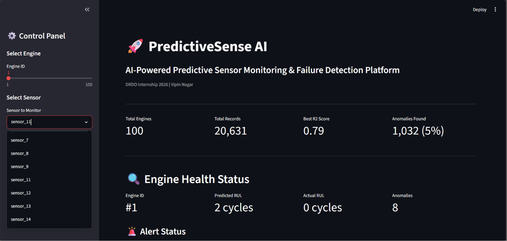
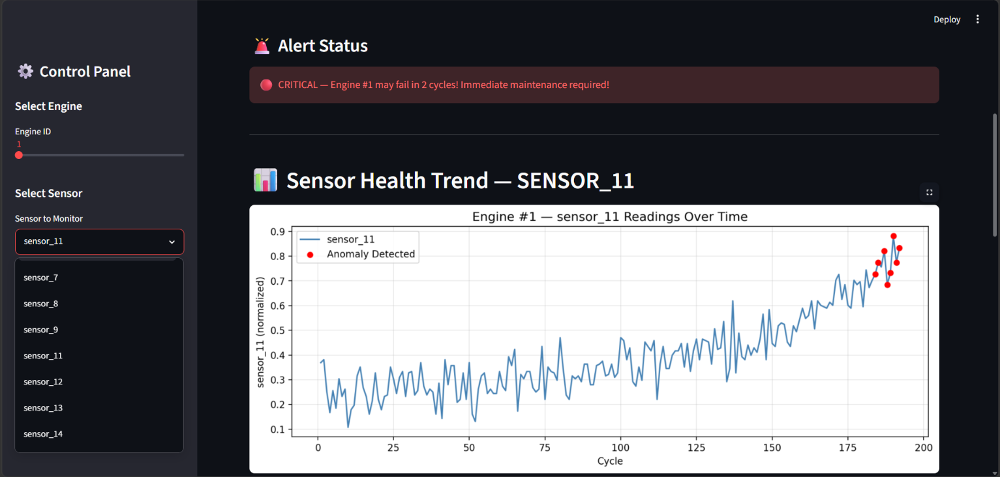
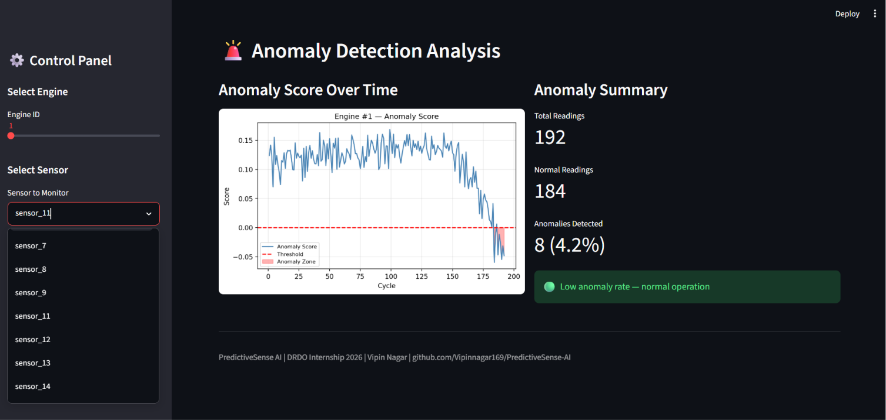
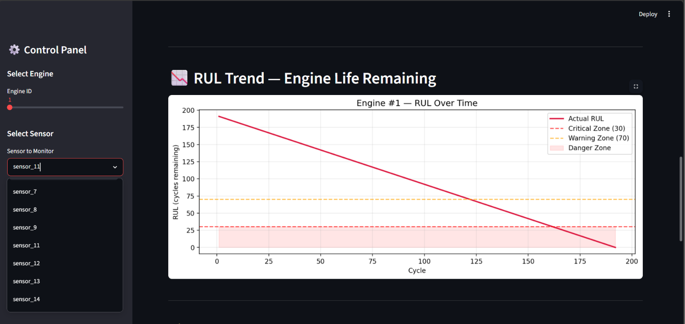

# 🚀 PredictiveSense AI
### AI-Powered Predictive Sensor Monitoring & Failure Detection Platform


---

## 📌 Project Overview
PredictiveSense AI is an end-to-end machine learning platform that monitors
multivariate sensor data from industrial and defence-grade equipment to:
- 🔍 Detect anomalies in real-time sensor readings
- 📊 Predict Remaining Useful Life (RUL) of critical components
- 🚨 Generate early warning alerts before equipment failure
- 📈 Visualize sensor health trends on an interactive dashboard

> **DRDO Relevance:** Directly applicable to health monitoring of defence
> vehicles, aircraft engines, and mission-critical equipment.

---

## 🖥️ Live Dashboard Screenshots

### 1. Main Overview — Engine Health Status

> 100 engines monitored · 20,631 records · Best R² 0.79 · 1,032 anomalies (5%)

---

### 2. Critical Alert + Sensor Health Trend

> Real-time CRITICAL alert with anomaly dots highlighted on sensor trend chart

---

### 3. RUL Trend — Engine Life Remaining

> Actual RUL over time with Warning Zone (70) and Critical Zone (30) thresholds

---

### 4. Anomaly Detection Analysis

> Anomaly score over time · 8 anomalies detected (4.2%) for Engine #1

---

## 📊 Dataset
**NASA C-MAPSS Turbofan Engine Degradation Dataset**
- 100 engines monitored from start to failure
- 20,631 sensor readings after cleaning
- 21 sensor channels (after feature selection)
- Source: [Kaggle - NASA C-MAPSS](https://www.kaggle.com/datasets/behrad3d/nasa-cmaps)

---

## 🏗️ Project Structure

PredictiveSense-AI/

├── data/

│   ├── raw/                        # NASA C-MAPSS raw dataset

│   └── processed/                  # Cleaned & ML-ready data

├── notebooks/

│   ├── 01_data_exploration.ipynb

│   ├── 02_feature_engineering.ipynb

│   ├── 03_model_training.ipynb

│   ├── 04_model_improvement.ipynb

│   └── 05_anomaly_detection.ipynb

├── models/

│   ├── rf_improved.pkl             # Random Forest model

│   ├── iso_forest.pkl              # Isolation Forest model

│   └── lstm_model.pth              # PyTorch LSTM model

├── dashboard/

│   └── app.py                      # Streamlit dashboard (COMPLETE)

├── reports/

│   └── SRS_v1.0.docx               # Software Requirements Specification

├── screenshots/                    # Dashboard screenshots

├── src/                            # Python utility scripts

├── .gitignore

├── requirements.txt

└── README.md

---

## ⚙️ Tech Stack
| Technology | Purpose | Status |
|------------|---------|--------|
| Python 3.9+ | Core language | ✅ |
| Pandas & NumPy | Data manipulation & feature engineering | ✅ |
| Scikit-learn | Random Forest, Isolation Forest, preprocessing | ✅ |
| PyTorch | LSTM deep learning model | ✅ |
| Streamlit | Interactive real-time dashboard | ✅ |
| Plotly | Interactive charts & visualizations | ✅ |
| Matplotlib & Seaborn | EDA visualizations | ✅ |

---

## 📈 Model Results

### Random Forest — RUL Prediction
| Metric | Baseline | Improved | Improvement |
|--------|----------|----------|-------------|
| R² Score | 0.62 | **0.7949** | +28% |
| RMSE | 41.47 cycles | **18.66 cycles** | **55% better** |
| MAE | 29.63 cycles | **13.39 cycles** | 55% better |

### LSTM — Temporal Sequence Prediction
| Metric | Value |
|--------|-------|
| R² Score | **0.7742** |
| Architecture | LSTM → Linear |
| Sequence Window | 30 cycles |
| Epochs | 50 |

**Key Finding:** Sensor 11 is the most critical failure indicator (~40% feature importance)

---

## 🔍 Anomaly Detection
- **Algorithm:** Isolation Forest (contamination = 5%)
- **Anomalies Detected:** 1,032 out of 20,631 records **(5%)**
- **Finding:** Anomaly concentration peaks near failure zone (RUL < 50)
- **Model saved:** `models/iso_forest.pkl`

---

## 🚨 Alert System
| Status | RUL Range | Color | Action |
|--------|-----------|-------|--------|
| 🟢 HEALTHY | RUL > 80 cycles | Green | Normal operation |
| 🟡 WARNING | RUL 40–80 cycles | Yellow | Schedule maintenance |
| 🔴 CRITICAL | RUL < 40 cycles | Red | Immediate action required |

---

## 🚀 How to Run

```bash
# Clone the repository
git clone https://github.com/Vipinnagar169/PredictiveSense-AI.git
cd PredictiveSense-AI

# Install dependencies
pip install -r requirements.txt

# Run the Streamlit dashboard
streamlit run dashboard/app.py

# Open notebooks in order
# 01 → 02 → 03 → 04 → 05
```

Dashboard runs at: **http://localhost:8501**

---

## 📅 Progress Tracker

### Completed ✅
- [x] Day 1 — Environment Setup & Dataset Loading
- [x] Day 2 — Exploratory Data Analysis (EDA)
- [x] Day 3 — Feature Engineering & RUL Labelling
- [x] Day 4 — Random Forest Baseline Model
- [x] Day 5 — Model Improvement (55% RMSE reduction, R²: 0.7949)
- [x] Day 6 — Isolation Forest Anomaly Detection (1,032 anomalies)
- [x] Day 7 — GitHub Repository Setup
- [x] Day 8 — Professional README Documentation
- [x] Day 9 — PyTorch LSTM Model (R²: 0.7742)
- [x] Day 13-14 — Streamlit Dashboard (Complete with alerts + anomaly section)
- [x] Day 16 — SRS Document v1.0 (Word format, 12 sections)
- [x] Day 17 — README Update with Dashboard Screenshots

### Upcoming ⏳
- [ ] Day 18 — Final GitHub Polish (clean & updated)
- [ ] Day 19 — Week 3 Sunday Report
- [ ] Day 20+ — Cross-validation & Model Optimization
- [ ] Day 25+ — Docker Containerization
- [ ] Day 40+ — Final Report & Presentation
- [ ] Day 45 — Project Submission

---

## 📄 Documentation
- **SRS Document:** `reports/SRS_v1.0.docx` — Full Software Requirements Specification (12 sections)
- **Notebooks:** Step-by-step ML pipeline in `notebooks/`
- **Weekly Reports:** Submitted every Sunday to DRDO mentor

---

## 👨‍💻 Author
**Vipin Nagar**
Pre-Final Year B.E. (Information Technology)
DRDO Internship 2026
GitHub: [Vipinnagar169](https://github.com/Vipinnagar169/PredictiveSense-AI)

---
*Project developed during 45-day DRDO Internship (3 June – 17 July 2026)*
*Dataset: NASA C-MAPSS · Models: RF + LSTM + Isolation Forest · Dashboard: Streamlit*