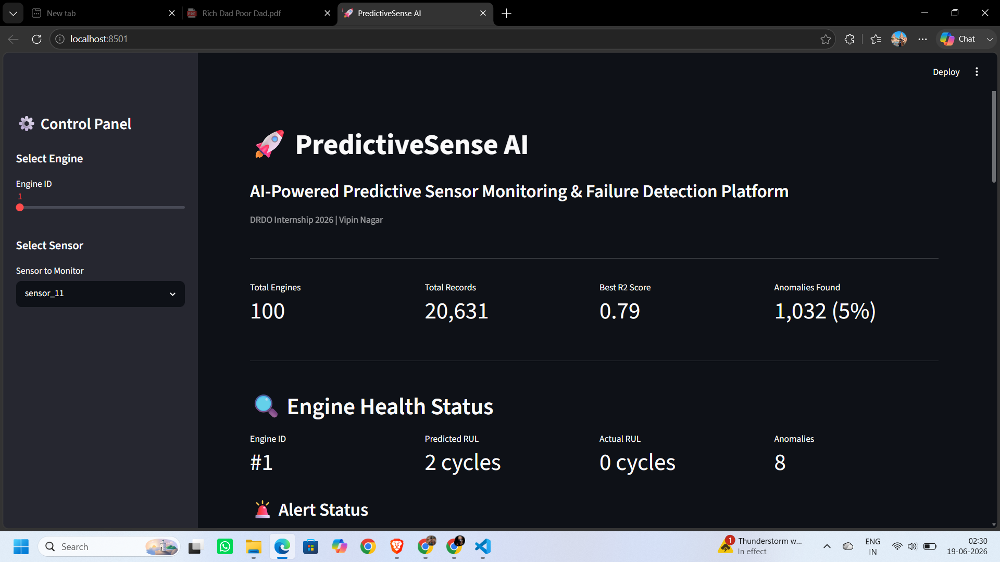
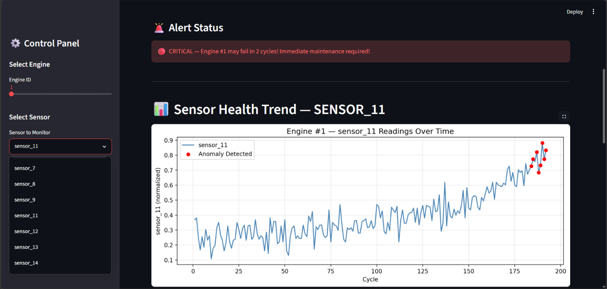
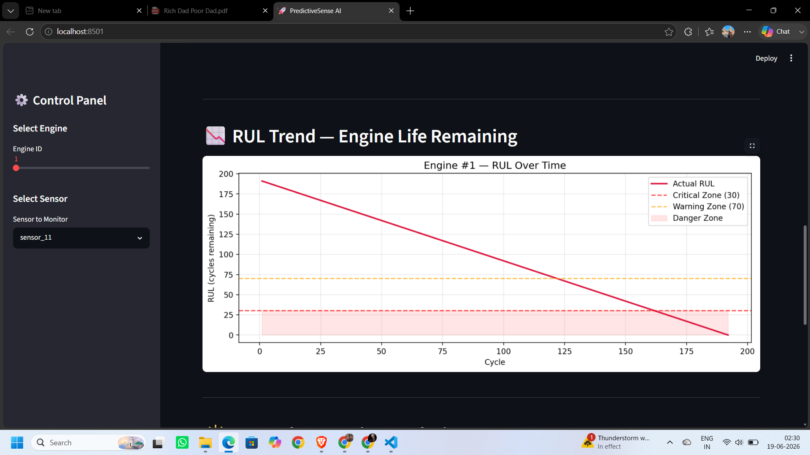
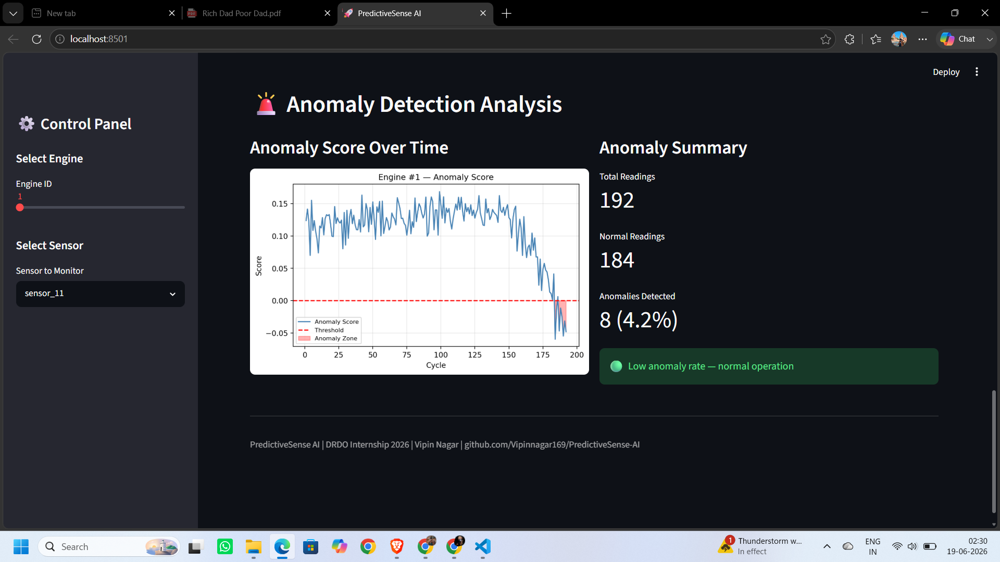

# 🚀 PredictiveSense AI
### AI-Powered Predictive Sensor Monitoring & Failure Detection Platform

[](https://predictivesense-ai.streamlit.app)


---

## 🌐 Live Demo
**Dashboard:** [predictivesense-ai.streamlit.app](https://predictivesense-ai.streamlit.app)

---

## 📌 Project Overview
PredictiveSense AI is an end-to-end machine learning platform that monitors
multivariate sensor data from industrial and defence-grade equipment to:
- 🔍 Detect anomalies in real-time sensor readings
- 📊 Predict Remaining Useful Life (RUL) of critical components
- 🚨 Generate early warning alerts before equipment failure
- 📈 Visualize sensor health trends on an interactive dashboard
- 🌐 Serve predictions via REST API (FastAPI)
- 🐳 Deploy anywhere via Docker container

> **DRDO Relevance:** Directly applicable to health monitoring of defence
> vehicles, aircraft engines, and mission-critical equipment.

---

## 🖥️ Live Dashboard Screenshots

### 1. Main Overview — Engine Health Status

> 100 engines monitored · 20,631 records · Best R² 0.79 · 1,032 anomalies (5%)

---

### 2. Critical Alert + Sensor Health Trend

> Real-time CRITICAL alert with anomaly dots highlighted on sensor trend chart

---

### 3. RUL Trend — Engine Life Remaining

> Actual RUL over time with Warning Zone (80) and Critical Zone (40) thresholds

---

### 4. Anomaly Detection Analysis

> Anomaly score over time · 8 anomalies detected (4.2%) for Engine #1

---

## 📊 Dataset
**NASA C-MAPSS Turbofan Engine Degradation Dataset**
- 100 engines monitored from start to failure
- 20,631 sensor readings after cleaning
- 21 sensor channels (after feature selection)
- Source: [Kaggle - NASA C-MAPSS](https://www.kaggle.com/datasets/behrad3d/nasa-cmaps)

---

## 🏗️ Project Structure

```
PredictiveSense-AI/
├── data/
│   ├── raw/                        # NASA C-MAPSS raw dataset
│   └── processed/                  # Cleaned & ML-ready data
├── notebooks/
│   ├── 01_data_exploration.ipynb
│   ├── 02_feature_engineering.ipynb
│   ├── 03_model_training.ipynb
│   ├── 04_model_improvement.ipynb
│   ├── 05_anomaly_detection.ipynb
│   ├── 06_lstm_model.ipynb
│   ├── 07_cross_validation.ipynb
│   └── 08_model_optimisation.ipynb
├── models/
│   ├── rf_optimised.pkl            # Optimised Random Forest (Best)
│   ├── rf_improved.pkl             # Improved Random Forest
│   ├── iso_forest.pkl              # Isolation Forest model
│   └── lstm_model.pth              # PyTorch LSTM model
├── dashboard/
│   └── app.py                      # Streamlit dashboard (LIVE)
├── src/
│   ├── api.py                      # FastAPI REST API
│   ├── test_pipeline.py            # Unit tests (10/10 passed)
│   └── test_integration.py         # Integration tests (8/8 passed)
├── reports/
│   ├── SRS_v2.0.docx               # Software Requirements Specification (latest)
│   ├── cv_results.png              # Cross-validation results plot
│   └── feature_importance_optimised.png
├── screenshots/                    # Dashboard screenshots
├── Dockerfile                      # Docker containerisation
├── run.bat                         # One-click Windows launcher
├── .gitignore
├── requirements.txt
└── README.md
```

## ⚙️ Tech Stack
| Technology | Purpose | Status |
|------------|---------|--------|
| Python 3.9+ | Core language | ✅ |
| Pandas & NumPy | Data manipulation & feature engineering | ✅ |
| Scikit-learn | Random Forest, Isolation Forest, GridSearchCV | ✅ |
| PyTorch | LSTM deep learning model | ✅ |
| Streamlit | Interactive real-time dashboard | ✅ |
| FastAPI | REST API for model serving | ✅ |
| Plotly | Interactive charts & visualizations | ✅ |
| Matplotlib & Seaborn | EDA visualizations | ✅ |
| pytest | Automated unit & integration testing | ✅ |
| Docker | Containerisation & deployment | ✅ |
| smtplib (Gmail SMTP) | Automated email alerts | ✅ |
| Git LFS | Large model file version control | ✅ |

---

## 📈 Model Results

### Random Forest — RUL Prediction
| Metric | Baseline | Improved | Optimised | Improvement |
|--------|----------|----------|-----------|-------------|
| R² Score | 0.62 | 0.7949 | **0.7956** | +28% |
| RMSE | 41.47 cycles | 18.66 cycles | **18.62 cycles** | **55% better** |
| MAE | 29.63 cycles | 13.39 cycles | **13.35 cycles** | 55% better |

### 5-Fold Cross-Validation
| Metric | Mean | Std Dev |
|--------|------|---------|
| R² Score | 0.6380 | ±0.0076 |
| RMSE | 41.43 cycles | ±0.32 |
| MAE | 29.31 cycles | ±0.26 |

### GridSearchCV — Best Parameters
- n_estimators: 300 | max_depth: 15 | min_samples_leaf: 4
- **Best CV R²: 0.8141**

### LSTM — Temporal Sequence Prediction
| Metric | Value |
|--------|-------|
| R² Score | **0.7742** |
| Architecture | LSTM → Linear |
| Sequence Window | 30 cycles |
| Epochs | 50 |

**Key Finding:** Sensor 11 is the most critical failure indicator (59.7% feature importance)

---

## 🔍 Anomaly Detection
- **Algorithm:** Isolation Forest (contamination = 5%)
- **Anomalies Detected:** 1,032 out of 20,631 records **(5%)**
- **Finding:** Anomaly concentration peaks near failure zone (RUL < 50)
- **Model saved:** `models/iso_forest.pkl`

---

## 🚨 Alert System
| Status | RUL Range | Color | Action |
|--------|-----------|-------|--------|
| 🟢 HEALTHY | RUL > 80 cycles | Green | Normal operation |
| 🟡 WARNING | RUL 40–80 cycles | Yellow | Schedule maintenance |
| 🔴 CRITICAL | RUL < 40 cycles | Red | Immediate action required |

---

## 📧 Email Alert System
Automated email notifications sent via Gmail SMTP whenever an engine enters a WARNING or CRITICAL state.

- **Trigger:** CRITICAL (RUL < 40) and WARNING (RUL 40–80) states
- **Delivery:** Formatted HTML email — red for CRITICAL, orange for WARNING
- **Recipient:** Configurable from the dashboard, persists across restarts (`config.txt`)
- **Sender:** `predictivesense.ai@gmail.com` (Gmail App Password)

---

## 🌐 REST API (FastAPI)
```bash
# Start API
uvicorn src.api:app --reload

# Predict RUL
POST http://localhost:8000/predict/rul
{"features": [18 sensor values]}

# Detect Anomaly
POST http://localhost:8000/predict/anomaly
{"features": [15 sensor values]}
```

---

## 🐳 Docker Deployment
```bash
# Build image
docker build -t predictivesense-ai .

# Run dashboard
docker run -p 8501:8501 predictivesense-ai

# Access at http://localhost:8501
```

---

## 🧪 Testing
```bash
# Unit tests (10/10)
pytest src/test_pipeline.py -v

# Integration tests (8/8)
pytest src/test_integration.py -v
```

---

## 🚀 How to Run

```bash
# Clone the repository
git clone https://github.com/Vipinnagar169/PredictiveSense-AI.git
cd PredictiveSense-AI

# Install dependencies
pip install -r requirements.txt

# Run the Streamlit dashboard
streamlit run dashboard/app.py
```

**Windows users:** just double-click `run.bat` — it activates the virtual environment and launches the dashboard automatically, no commands needed.

Dashboard runs at: **http://localhost:8501**
Live Demo: **https://predictivesense-ai.streamlit.app**

---

## 📅 Progress Tracker

### Completed ✅
- [x] Day 1-3 — Environment Setup, EDA, Feature Engineering
- [x] Day 4-5 — Random Forest (R²: 0.7949, RMSE: 18.66, 55% improvement)
- [x] Day 6 — Isolation Forest Anomaly Detection (1,032 anomalies)
- [x] Day 7-8 — GitHub Setup + Professional README
- [x] Day 9 — PyTorch LSTM Model (R²: 0.7742)
- [x] Day 13-14 — Streamlit Dashboard (Complete)
- [x] Day 16 — SRS Document v1.0 (12 sections)
- [x] Day 17-18 — README Screenshots + GitHub Polish
- [x] Day 20-21 — 5-Fold CV + GridSearchCV (Best CV R²: 0.8141)
- [x] Day 22 — Pytest Unit Tests (10/10 passed)
- [x] Day 23 — FastAPI REST API
- [x] Day 24 — Git LFS + Models GitHub Deploy (258 MB)
- [x] Day 27 — Docker Containerisation
- [x] Day 28-29 — Integration Tests + Code Documentation
- [x] Day 30 — Streamlit Cloud Live Deployment 🌐
- [x] Day 31 — Automated Email Alert System (Gmail SMTP)
- [x] Day 34 — run.bat One-Click Launcher
- [x] Day 37 — SRS Document v2.0 Update
- [x] Day 38 — README Final Polish
- [x] Day 39 — Buffer Day: Dependency Fix + Security Hardening (QA)
- [x] Day 40-41 — Week 6 Report Submitted
- [x] Day 42-45 — Final Presentation, Final Report & Project Submission

### Project Status: Complete ✅
Internship successfully completed on 17 July 2026 — all deliverables submitted to DRDO mentor (Sh. Umesh Chaturvedi, Scientist-E).


---

## 📄 Documentation
- **Live Dashboard:** [predictivesense-ai.streamlit.app](https://predictivesense-ai.streamlit.app)
- **SRS Document:** `reports/SRS_v2.0.docx`
- **Notebooks:** Step-by-step ML pipeline in `notebooks/`
- **Weekly Reports:** Submitted every Sunday to DRDO mentor

---

## 👨‍💻 Author
**Vipin Nagar**
Pre-Final Year B.E. (Information Technology)
DRDO Internship 2026
GitHub: [Vipinnagar169](https://github.com/Vipinnagar169/PredictiveSense-AI)

---
*Project developed during 45-day DRDO Internship (3 June – 17 July 2026)*
*Dataset: NASA C-MAPSS · Models: RF + LSTM + Isolation Forest · Dashboard: Streamlit*
*Live: predictivesense-ai.streamlit.app*